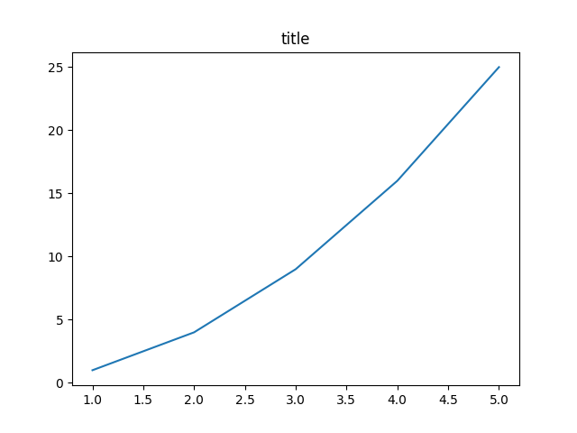
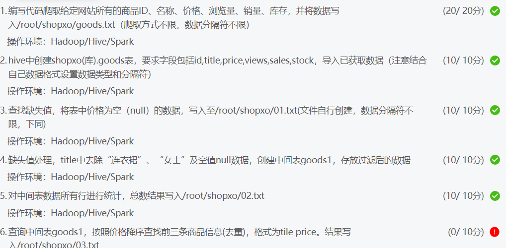

# 2023年'智警杯'比赛


## Python数据分析
### 一些常用的库
* `Numpy`: 提供多维数组对象，各种派生对象（如掩码数组和矩阵），以及用于数组快速操作的各种API，有包括数学、逻辑、形状操作、排序、选择、输入输出、离散傅立叶变换、基本线性代数，基本统计运算和随机模拟等等。
* `Pandas`: pandas是一个强大的分析结构化数据的工具集；它的使用基础是Numpy（提供高性能的矩阵运算）；用于数据挖掘和数据分析，同时也提供数据清洗功能。
* `Matplotlib`: 是Python中最常用的可视化工具之一，可以非常方便地创建海量类型地2D图表和一些基本的3D图表，可根据数据集（DataFrame，Series）自行定义x,y轴，绘制图形（线形图，柱状图，直方图，密度图，散布图等等），能够解决大部分的需要。Matplotlib中最基础的模块是pyplot。
* `Requests`: Requests是用Python语言编写，基于 urllib，采用 Apache2 Licensed 开源协议的 HTTP 库。
* `BeautifulSoup`: BeautifulSoup是python的一个库，最主要的功能就是从网页爬取我们  需要的数据。BeautifulSoup将html解析为对象进行处理，全部页面转换为字典或数组。
* `lxml`: lxml是XML和HTML的解析器，其主要功能是解析和提取XML和HTML中的数据；lxml和正则一样，也是用C语言实现的，是一款高性能的python HTML、XML解析器，也可以利用XPath语法，来定位特定的元素及节点信息。
### Numpy
引用模块
```Python
import numpy as np
```
### Pandas
引用模块
```Python
import pandas as pd
```
读取文件
```Python
data = pd.read_csv(file_path, header=0, sep=',', engine='python', encoding='utf-8', keep_default_na=False)
```
`read_csv`一些参数解释
|参数|解释|
|:---|:----|
|`sep`|指定分隔符。默认`,`分隔。|
|`header`|指定行数用来作为列名，数据开始行数。|
|`engine`|使用的分析引擎。可以选择`C`或者是`python`。C引擎快但是`Python`引擎功能更加完备。|
|`encoding`|指定字符集类型，通常指定为`utf-8`。|
|`na_values`|指定缺失值，为列表或者集合|
|`keep_default_na`|设为False之后同时不定义na_values参数，就可以在读取文件时不将任何值转换为缺失值NaN。|

数据筛选
```Python
data_1 = data[data['列名'] == '指定值']  # 筛选指定列的指定值

data_1 = data[pd.to_datetime(data['时间']) >= pd.to_datetime('2023-01-01')]  # 筛选时间列的时间范围

data_1 = data[data['列名'].str.contains('值1|值2|值3')]  # 筛选指定列包含的值，使用'|'进行分割，相当于 or
```

数据读取和导出
```Python
print(data_1.values)  # 以列表的形式输出
print(data_1['列名'].value_counts())  # 统计该列名的值数量

data_1.to_csv('data.csv', index=False)  # 导出为csv文件，去除行索引
data_1.to_csv('data.txt', sep=',', index=False, header=False)  # 导出为txt文件，去除列索引和行索引

# 以下是使用open方法保存文件
for row in data_1.values:
    with open('data.txt', 'a', encoding='utf-8') as file:
        file.write(','.join(row) + '\n')  # 自定义分隔符
```

### Matplotlib
引用模块
```Python
import matplotlib.pyplot as plt
```
一个简单例子:
```Python
plt.title("title")  # 标题的名称

x = [1, 2, 3, 4, 5]
y = [1, 4, 9, 16, 25]

plt.plot(x,y)  # 绘制图像

plt.savefig('plt_example.png') # 保存图片

plt.show() # 显示图像
```
这是输出的图片



### Requests
引用模块
```Python
import requests
```
示例
```Python
response = requests.get('https://www.xxx.com/')  # 发送请求

print(response.text)  # 获取响应内容
print(response.status_code)  # 获取响应状态码
print(response.headers)  # 获取响应头
```

### BeautifulSoup
引用模块
```Python
from bs4 import BeautifulSoup
```
解析HTML代码
```Python
html = BeautifulSoup(text, 'lxml')
```

### lxml
引用模块
```Python
from lxml import etree
```
解析HTML代码
```Python
html = etree.HTML(text)
```

## Hadoop数据分析

### MySQL
```bash
systemctl start mysqld.service # 启动mysql服务
systemctl stop mysqld.service # 停止mysql服务
systemctl restart mysqld.service # 重启mysql服务
systemctl status mysqld.service # 查看mysql服务状态
```

### Hadoop
```bash
start-all.sh # 启动Hadoop集群
stop-all.sh # 关闭Hadoop集群

# 以下为单模块启动
start-dfs.sh # 启动HDFS模块
stop-dfs.sh # 关闭HDFS模块

start-yarn.sh # 启动yarn集群
stop-yarn.sh # 关闭yarn集群
```
以下命令的区别
```bash
hadoop fs [options]
hadoop dfs [options]
hdfs dfs [options]
```
- `hadoop fs`：通用的文件系统命令，针对任何系统，比如本地文件、HDFS文件、HFTP文件、S3文件系统等。
- `hadoop dfs`：特定针对HDFS的文件系统的相关操作，但是已经不推荐使用。
- `hdfs dfs`：与hadoop dfs类似，同样是针对HDFS文件系统的操作，替代hadoop dfs

### HDFS
```bash
hdfs namenode -format # 格式化HDFS文件系统
```


### Hive
注: 伪集群的Hive通过Reduce操作时是真的慢，基本都是1分钟以上，使用能不用Hive就不用Hive。
```bash
schematool -dbType mysql -initSchema  # 初始化Hive元数据库

hive # 进入Hive

hive> create database <库名>;  # 创建Hive数据库

hive> use <库名>;  #进入数据库

hive> create table <表名>(id int,name string);  #创建数据表

hive> insert into <表名> values (1,"zhangsan");  #插入数据
```
以下例子为创建字段：id,title,price,views,sales,stock的表，并导入csv数据。
```bash
hive> create table goods(
    >     id int,
    >     title string,
    >     price double,
    >     views int,
    >     sales int,
    >     stock int
    > ) 
    > row format delimited fields terminated by ','; #创建数据表,指定了逗号作为列分隔符; 

hive> load data local inpath '/data/csv2.csv' into table goods;  # 导入csv文件数据

hive> load data local inpath '/data/goods.txt' into table goods;  # 导入csv文件数据
``` 
以下例子是通过Reduce查询价格(price)为空的记录并写入到某一路径。
```bash
hive> insert overwrite local directory '/root/'
    > row format delimited fields terminated by '\t'  # 数据分隔符'\t'
    > select * from goods where price is null;  # 查询语句
```
当然有更简单的方法。
```bash
hive -e "use shopxo;select * from goods where price is null;" > /root/shopxo/out.txt  # 在hive外执行
```
以下是将查询结果保存到表的语句。
```bash
hive> insert overwrite table goods1  # goods1 为表名称
    > select * 
    > from goods 
    > where title not like "%连衣裙%" 
    >   and title not like "%女士%" 
    >   and title is not null;

# 以下是直接创建新表的语句
hive> create table goods1 as # goods1 为创建的新表名称
    > select * 
    > from goods 
    > where title not like "%连衣裙%" 
    >   and title not like "%女士%"
    >   and title is not null;
```

### 一些问题

其中第4题的空值null数据是值上一题的价格(price)为空值(null)而不是标题(title)为null